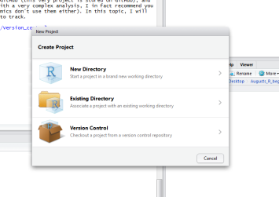

```{r setup, include=FALSE}
knitr::opts_chunk$set(echo = TRUE)
```

###What is scaffolding?

Scaffolding (or structuring) a project simply means setting up your files in a project folder to make it easier to manage and to organise. Naturally, you will only need to manage your project in such a manner if you have a lot of files. If, for example, you only have one R script file to run, then it is more or less unnecessary to use R projects at all (we will talk about projects in a second). If, however, you have several data files (e.g. a .csv table for documenting some aspects of your species and a raster file for spatial information) or wish to produce several outputs using slightly modified codes from the same script, then scaffolding your project and version controlling it will save you a lot of time.  

###What is a project?
Projects in Rstudio allow you organise and keep track of your analysis neatly. When you create or load a R project, your Rstudio will start a new session (so remember to save your data and scripts before you do this!), and automatically set your working directory to the project's base folder (where the .Rproj file is). Working with analysis in a project is a lot neater when you have a lot of things to keep tracks of, and again, of course you don't have to always use one. Another benefit of R projects is that they make your analysis reproducible and accessible if the need arises, since you can share R projects with other people.  

For more on R projects: <https://support.rstudio.com/hc/en-us/articles/200526207-Using-Projects>


###What is version control?

I've mentioned this idea a few times already: version control is just fancy language for keeping track of things. Specifically, it means documenting all the changes you (or others sharing the project) made to your project, so that at any time if you need to back track and see what you've done wrong (which happens to all of us a lot), it's a lot easier to do so. There are many platforms for version control, for example GitHub (this very project is stored on GitHub), and they can have pretty steep learning curves. Unless you are working with a very complex analysis, I in fact recommend you not to bother with them (many much more senior and experienced academics don't use them either). In this topic, I will show you some simple things you can do to make your progress easier to track.  

Wikipedia article on version control: <https://en.wikipedia.org/wiki/Version_control>

***

##Creating a R project and organising it

You can create a project in R by simply going to File > New Project in Rstudio. At this point you will be presented with options to create the project in a new directory, in an existing directory, or using version control (see below). At this stage let's not worry about version control yet.



Once you've created a R project, a .Rproj file will be automatically generated in your chosen working directory. In the future, opening the .Rproj file in Rstudio will load the project in your Rstudio. Alternatively, you could start Rstudio first, and go to File > Open project to open an existing project.  

Once you are in the project folder, you can freely create or delete sub folders both in R and outside R. You can make use of sub folders to organise your files. For example, the simplest scaffold templates could look like this:  

```
proj/
├── R/
├── data/
├── doc/
├── figs/
└── output/
└── Your main R scripts.R
```
This is in fact the template I'm using for my analysis and I found it to be really useful. To give you an impression about what it looks like, here's my project folder.


If you want more complicated structure, check out the R package "projectTemplate", which offers R functions for automatically generating templates.  

In essence, all the different structures of sub folders serve the same purpose: helping you to categorise your messy R files. Make simple rules for yourself about what belongs to which folder and follow these rules, they will save you a lot of time spent looking for things.  

In the example template above, I've set the following rules for myself:  

`R/`: all of my scripts go here, except for the main R script, which is in the base folder. These scripts include things like: recyclable codes, pre-written functions, loops, scripts for analysing some aspect of my data, Rmarkdown .rmd files etc. To load scripts, you can use `source()` function in R.  

`data/`: where I put my raw data, the rule here is I don't change or delete any data in this folder, so that I always have the raw data at the very beginning to work with. However, I do save my cleaned/reduced data sets in the same folder, I'll just name them differently so they do not override the original raw data. To load data, use `load()` function in R.  

`doc/`: references, Rmarkdown outputs, paper manuscripts, drafts etc. Some people also separate references in another folder (e.g. `refs/` or `libs/`).  

`figs/, output/`: these are the figures and results that R spits out. Important thing here is they are discard-able, and you can make as many as you like from your R scripts. Separating outputs from inputs(i.e. data) is a very important practice in organising stuff in R project.  

`Your main R scripts.R`: This is the master script for your main analysis, running through these scripts should directly reproduce your analysis. If your codes are very long, it's worth considering having multiple main script files (i.e. main script pt1.R, main script pt2.R and so on).  

***
For more on project scaffolding, check the following links:

<https://nicercode.github.io/blog/2013-04-05-projects/>  
<https://nicercode.github.io/blog/2013-05-17-organising-my-project/>

***

##Basic version control

If you have a messy project with lots of things in it and it's getting very hard to keep track of everything, then I suggest using some version control programs such as GitHub. But if you have a simple project and you are confident that you can keep track of things manually with ease, then perhaps the following tips could be of help.  

####keep a diary
Make a .txt file or a word document in your project folder, and every time you make progress or changes to your project, write down what you did, which files you touched, and the date you did it.  

####order your files with number
I like to order my scripts and documents, so that it's easier to track the processes of my analysis and what I have to do before doing another thing. For example, check the screenshot below of my `R/` folder.  


####keep commenting on your codes
Sometimes it's easy to forget why you did something or what you did. To remind your future self what you are doing, it's good practice to keep comments for your R codes as detailed as possible. For example:

```{r}
####use the '#' symbol to make comments in your codes, if you put # in front of something then R will not evaluate it. 
#here I am loading one of R's in-built data set, iris. For detail, type ?iris in your console
iris <- iris #I can also make comments as a suffix to a code, R wouldn't run anything that comes after the # symbol
#selecting only the species Iris Setosa
setosa <- iris[iris$Species == 'setosa',]
#read the first few elements of newly defined setosa
head(setosa)
####with all of these comments for everything you did, you are unlikely to confuse your future self.
```

####do not delete old codes
By this I mean, if you change a chunk of your code to do something else, sometimes it's a good idea not to delete your older codes, as they might become useful in the future. But of course, if your code had an error and couldn't run, then you naturally needn't keep it. However, it could also be worthwhile to leave a comment on what error you had and how you solved it, so that if you run into the same problem again you'll know what to do.  

A very simple way to 'retire' older codes without deleting them is simply adding '#' in front, so that R will not evaluate them. For example:

```{r}
iris <- iris
setosa <- iris[iris$Species == 'setosa',]
#I realised all of setosa had petal width below 1, which distinguishes them from the other species, therefore I can select setosas by specifying to R that I want to select all data with a petal width less than 1
#setosa <- iris[iris$Species == 'setosa',] #this is the old code for assigning setosa, I've made it obsolete but I'm keeping it here
setosa <- iris[iris$Petal.Width < 1,] #this is the new code
head(setosa) #shows same result as last time
```

***

This is the end of this topic, I hope I have helped you to form some good habits for using R, and hopefully this will save you trouble in the future!  

August
