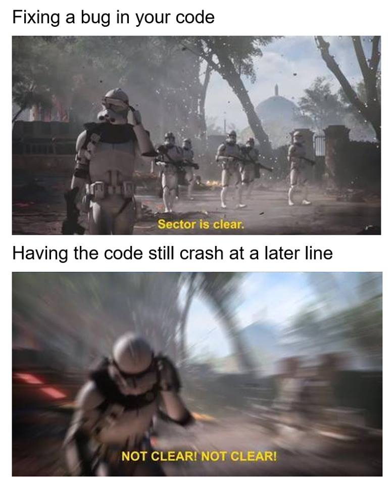

# Welcome to August's R beginner respository
noob R stuff written by a noob

Code in this repository is copyright of August(Tianxiao) Hao, 2017.  





### Introduction

Hi people, 

Feeling alone in the long and hard struggle against R? I got u fam  

Actually I don't, I'm still struggling everyday and probably will struggle for the rest of my life, but  c'est la vie so I thought why not put together some materials and knowledge (which I've stolen from smarter people) for the benefits of all? (I'm a filthy commie I know)  

So here we go, in this repository you will find materials on different topics in beginner's R, and hopefully they can help you to struggle ever so slightly less with the nightmare that is R, but hey at least you are now officially above the plebs still using Excel or SPSS! (laughing at them is the only way I get any sense of self-validation, please don't judge me)  

### What this repository is and is not

I should start with a BIG DISCLAIMER that this repository will NOT teach you the basics of using R. The reason for this is very simple: there are much much better guides and tutorials out there both online and in person. If you are completely new to R or think you need to brush up your skills, make sure to check out basic courses such as [**Datacamp's free online course in R**](https://www.datacamp.com/courses/free-introduction-to-r), which I consider to be the go-to place for R basics. There are plenty other places to check out for R learning too, which I will link to in the **Resources** section below.  

What this repository IS is a place where I write about my experiences in dealing with particular challenges as a learner of R, and hopefully providing some help or guidance to fellow R coders who may also be suffering the same difficulties. I plan to do this by writing a few brief paragraphs on different topics (listed further down on this page), containing both my own recommendations and resource/links for further learning about said topic. Again, this is unfortunately limited by my experience with R, and probably doesn't cover everything you might have questions for. But perhaps it will grow to be something bigger with your contribution!

### Resources

Here are some links to general materials that I find helpful in learning R.  

1. two books on learning R [*R Programming for Data Science* by Roger D. Peng](http://www.cs.upc.edu/~robert/teaching/estadistica/rprogramming.pdf), and [Jones, Owen, Robert Maillardet, and Andrew Robinson. *Introduction to scientific programming and simulation using R.* CRC Press, 2014.](https://www-taylorfrancis-com.ezp.lib.unimelb.edu.au/books/9781420068740) (link is unimelb only). -- never read the first one myself but it's online and free! Second one is written by unimelb researchers which unfortunately does put it behind a paywall, but I reckon it's definitely worth a read if you could get your hands on a copy.
2. [**a free online course for basics in R**](https://www.datacamp.com/courses/free-introduction-to-r) (data types, formats, basic operators etc.) -- I've linked to this in the section above too
3. a book on data handling [*R for Data Science* by Garrett Grolemund & Hadley Wickham](http://r4ds.had.co.nz/index.html). -- you will hear the name Hadley Wickham a lot in R communities, he's basically a God of R who's making a better version of all of R's basic functionalities. That being said you can often get away without using any of his packages, I barely touched any of the fancy Hadleyverse packages myself but if your project is data heavy it will come in handy for you.
4. [swirl](http://swirlstats.com/) -- a R package for interactively learning R
5. [Wonderful R basics workshop material](https://nikkirubinstein.gitbooks.io/resguides-introductory-r-workshop/content/content/01-rstudio-intro.html) provided by the ~~Research Bazaar's~~ Research Platform Services' R workshop -- they also run free R beginner workshops monthly at unimelb, make sure to check them out!
6. [Material for another amazing R workshop created by Elise Gould of QAEco, thanks Elise!](https://github.com/egouldo/VicBioCon17_data_wrangling) -- this is meant mostly for using R to handle data (importing, organising, cleaning, and analysing), and extensively uses Hadleyverse packages, imo it's a must for anyone into using Hadleyverse  
7. [Some readings on how to better interpret R error messages](https://methodsblog.wordpress.com/2018/01/26/r-errors/?utm_source=feedburner&utm_medium=email&utm_campaign=Feed%3A+wordpress%2Fmethodsblog+%28methods.blog%29)
8. [Guide on QAEco wiki](https://github.com/qaecology/wiki_public/wiki/Coding-and-statistics-resources) which contains plenty of links for learning different aspects of R.

### Topics

I'm hoping to cover a few topics relevant to R beginners in this repository, they are not in particular order, although I will naturally start with easier topics first. If there is any topic that you would like to contribute on, please feel free to do so!  

I'm not intending on teaching topics in great details, and I hope to often point you to better guides written by more competent people.


***

The list of topics are:  

* Project scaffolding and manual version control (read: how to better manage your bloated R folders and keep track of what you've done) --- completed 03/03/2017

* Version control using GitHub (which will familiarise you with how to contribute to this repository) --- completed 10/03/2017

* Basics of Rmarkdown (how to write documents in R like this one) --- completed 10/03/2017

* Basic data cleaning and organising in R (read: for anything slightly more complicated than what I've shown you should use tidyverse packages!) --- completed 26/07/2017

* Loops/statements (your "if, for, and while" stuff) --- completed 09/02/18

* Writing functions (how to spend hours doing somthing that has a small chance of saving you minutes in the future)

* Making pretty figures using ```ggplot```

* Introducing miscellaneous R packages that you might find useful 

* Species Distribution Modelling (only basics)  

* Keeping big projects tidy and reproducible --- completed 28/01/2018

***

**tl;dr** here's some stuff that might help you learn R  


Cheers  
August