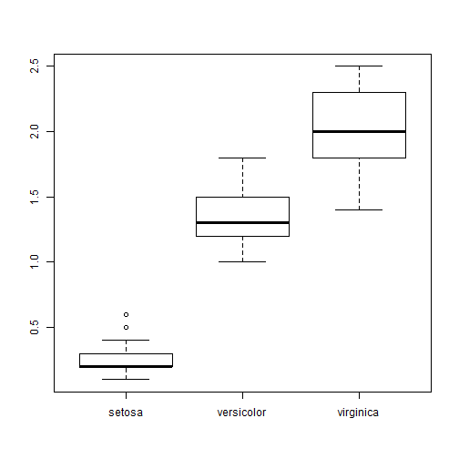

# Rmarkdown
### August Hao


## Rmarkdown? You are looking at it!

This very document you are reading right now is written using Rmarkdown, it's super easy and a very effective way to document and to present things. Basically, Rmarkdown is a R package that allows you to write files (.html, .doc, .pdf) from R straight away and embed R codes and analysis in them.  

A major advantage over conventional writing tools such as Microsoft Doc is that Rmarkdown embeds R codes exactly the way they are, so that if you are to copy codes from a Rmarkdown file and run them in R, you don't have to make any change!  

Another reason to use Rmarkdown is that it offers you the chance to run analysis inside a document, so that it basically allows you to print out your workflow from start to finish. This is good for both making your analysis reproducible and for illustrating to others (e.g. your supervisors) exactly what you did in R (and potentially what problems you ran into).

## Installing and using Rmarkdown

Rmarkdown is superbly easy to learn and use, which cannot be said for most R-related things. To install Rmarkdown, simply install the package 'Rmarkdown' from your Rstudio:


```r
install.packages("rmarkdown")
```


After the package is installed, you will be able to create new Rmarkdown files (typically with the suffix .rmd) and start writing them on your own. I found the easiest way to learn syntax and codes of Rmarkdown is by constantly referring to the cheatsheet <https://www.rstudio.com/wp-content/uploads/2016/03/rmarkdown-cheatsheet-2.0.pdf>, you will find everything you need there. If you have Rmarkdown package installed, you will even be able to call up this cheatsheet from Rstudio, by going to Help > cheatsheets > Rmarkdown Cheat Sheet.  


I will not introduce the syntax of Rmarkdown further myself, the cheatsheet does it much better than me. The best way of learning Rmarkdown is just by using it, and it is really easy to use!  

If you want more information on Rmarkdown, you could visit their [official website](http://rmarkdown.rstudio.com/) or search up "Rmarkdown" on the internet, there are plenty of helpful materials.


## Demonstrating code chunks in Rmarkdown

For the rest of this topic, I'm going to demonstrate what embedded code chunks look like and what you could do with them in Rmarkdown. Since this is a Rmarkdown file, I could embed a code chunk straightaway:  


```r
#for demonstration, let's call the iris data again
iris <- iris
#let's tell R to print the first few values of iris (I could call for the entire data set as well, but that would take too much space...)
head(iris)
```

```
##   Sepal.Length Sepal.Width Petal.Length Petal.Width Species
## 1          5.1         3.5          1.4         0.2  setosa
## 2          4.9         3.0          1.4         0.2  setosa
## 3          4.7         3.2          1.3         0.2  setosa
## 4          4.6         3.1          1.5         0.2  setosa
## 5          5.0         3.6          1.4         0.2  setosa
## 6          5.4         3.9          1.7         0.4  setosa
```

Rmarkdown prints out the file and displays it inside the document, neat! Note that this file is knitted (their way of saying making something) as a .md file specifically for GitHub. When you knit your own Rmarkdown documents as .html, the page layout might be a little bit different.  

Let's do some operations with the data, and check how Rmarkdown presents the results:


```r
#say if we are only using petal.width and species for our analysis
iris_new <- iris[,4:5]#here I'm assigning a new data frame with only the 4th and the 5th columns of the original iris data.
str(iris_new)#checking the structure of our new data set, note how column number is 2 instead of 5
```

```
## 'data.frame':	150 obs. of  2 variables:
##  $ Petal.Width: num  0.2 0.2 0.2 0.2 0.2 0.4 0.3 0.2 0.2 0.1 ...
##  $ Species    : Factor w/ 3 levels "setosa","versicolor",..: 1 1 1 1 1 1 1 1 1 1 ...
```

```r
#let's try to find out if there is a relationship between species and petal width, let's plot one against another
plot(iris_new[,2],iris_new[,1])
```

 

See how both R's response to `str(iris_new)` and the plot were generated in this document, this is much faster than copying and pasting them to a word document when you want to show them to someone.  

Now just to finish demonstrating with this dataset, let's test the statistical significance between petal width and species, and build a simple linear model with them (you don't have to understand what I'm doing here, this is just to show you what sort of responses R will have when I put in these codes)


```r
#build a linear model to use species to predict petal width
iris.lm <- lm(formula= Petal.Width ~ Species - 1, data = iris_new) # the - 1 is for omitting intercept
summary(iris.lm)
```

```
## 
## Call:
## lm(formula = Petal.Width ~ Species - 1, data = iris_new)
## 
## Residuals:
##    Min     1Q Median     3Q    Max 
## -0.626 -0.126 -0.026  0.154  0.474 
## 
## Coefficients:
##                   Estimate Std. Error t value Pr(>|t|)    
## Speciessetosa      0.24600    0.02894    8.50 1.96e-14 ***
## Speciesversicolor  1.32600    0.02894   45.82  < 2e-16 ***
## Speciesvirginica   2.02600    0.02894   70.00  < 2e-16 ***
## ---
## Signif. codes:  0 '***' 0.001 '**' 0.01 '*' 0.05 '.' 0.1 ' ' 1
## 
## Residual standard error: 0.2047 on 147 degrees of freedom
## Multiple R-squared:  0.9796,	Adjusted R-squared:  0.9792 
## F-statistic:  2357 on 3 and 147 DF,  p-value: < 2.2e-16
```

```r
anova(iris.lm)
```

```
## Analysis of Variance Table
## 
## Response: Petal.Width
##            Df  Sum Sq Mean Sq F value    Pr(>F)    
## Species     3 296.173  98.724  2357.2 < 2.2e-16 ***
## Residuals 147   6.157   0.042                      
## ---
## Signif. codes:  0 '***' 0.001 '**' 0.01 '*' 0.05 '.' 0.1 ' ' 1
```

***
Again, as you see above, using Rmarkdown is a great way of making your analysis transparent and easy to be shown to others.
